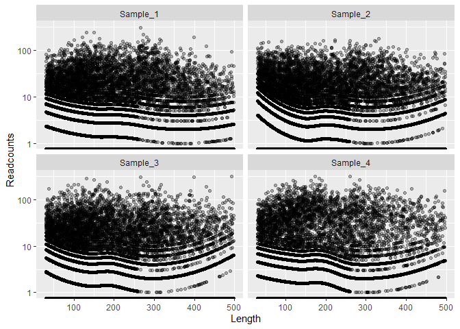

The microrms R package
================
Lars Snipen

-   [Installation](#installation)
-   [Tutorial 1 - microbial community composition](#tutorial-1---microbial-community-composition)
    -   [Creating the RMS object](#creating-the-rms-object)
        -   [Collecting RMS fragments](#collecting-rms-fragments)
        -   [The RMS object](#the-rms-object)
        -   [Genome similarity and resolution](#genome-similarity-and-resolution)
    -   [Processing reads](#processing-reads)
    -   [Mapping reads to clusters](#mapping-reads-to-clusters)
        -   [The readcount matrix](#the-readcount-matrix)
        -   [Length normalization](#length-normalization)
    -   [Estimating abundances](#estimating-abundances)
        -   [The Constrained Ordinary Least Square (COLS)](#the-constrained-ordinary-least-square-cols)
        -   [Comparing to gold standard](#comparing-to-gold-standard)
    -   [New data](#new-data)
-   [Tutorial 2 - subspecies resolution](#tutorial-2---subspecies-resolution)

Installation
============

To install directly from GitHub you first need to install the packages `devtools`. Start R and:

``` r
install.packages("devtools")
```

or if you use RStudio, use the meny Tools - Install Packages... You may also need the package `githubinstall`. If so, install it the same way as above.

Next, you should be able to install this package by

``` r
devtools::install_github("larssnip/microrms")
```

Several of the R functions calls upon the software `vsearch` that must be installed and available on the system, see [VSEARCH on GitHub](https://github.com/torognes/vsearch). To test if `vsearch` is available from R, type

``` r
system("vsearch -h")
```

in the Console, and return. A long Help-text should be displayed. If not, you need to install `vsearch` and edit your PATH environment variable to make it available. On UNIX systems you probably need to make use of the .Renviron and/or .Rprofile files for making it visible inside R.

Below are two short tutorial, to get you going. The first shows a basic nalysis on a very small data set. The second digs more into the resolution of this method.

Tutorial 1 - microbial community composition
============================================

This is a short step-by-step tutorial on a small toy example to illustrate a typical RMS study. We want to estimate the abundance of various taxa in a microbial community. Just as for shotgun metagenome data, this is a 'closed reference' type of assignment. This means we have a set of already sequenced genomes, and estimate the relative abundances of these in the sequenced samples. Instead of full shotgun sequencing, we have used the Reduced Metagenome Sequencing approach, i.e. sequencing of amplicons obtained by restriction enzyme cutting of the genomes. The use of RMS to discover new taxa is out of the scope of this tutorial.

You need to install the `tidyverse` and `ggdendro` R packages as these are used in the example code below, in addition to the `microrms` package and its dependencies.

Download the archive [RMStutorial.tar.gz](http://arken.nmbu.no/~larssn/soft/RMStutorial.tar.gz), and unzip it to some folder named `RMStutorial`. It should contain the folders `gnm`, `fastq`, `fasta`, `frg` and `tmp`, where the latter three are empty. There should also a file `gold_standard.txt`. The last folder, `ecoli_frg`, is used in the second tutorial below.

Start R/RStudio and make the `RMStutorial` your working directory for this R session, e.g.

``` r
setwd("C:/my_tutorials/RMStutorial")   # edit this
```

where you need to replace the path above with the correct one depending on where you unzipped the archive.

Create a new R-script, copy the code chunks below into it, and save it in the `RMStutorial` folder. Step through this, and inspect the results.

After some code chunks below there are some output lines, usually starting with `##`. Do not copy these into your R-script.

Creating the RMS object
-----------------------

First, we need a collection of sequenced genomes that cover the community we want to study. For this tutorial, we have collected 10 genomes in the `gnm/` folder. From every genome, we collect all RMS fragments, cluster these, and create the fragment cluster *copy number matrix* which is the central data structure of this method. In real life your genome collection would be larger, hundreds or thousands of genomes, depending on the environment you study.

All information is stored in an *rms object*, which is simply a `list` with several tables and matrices. It is convenient to have all data assembled into one object like this, and since this is a simple list you have full access to all components.

### Collecting RMS fragments

First, we collect the RMS fragments from each genome, and store these as fasta-formatted files in a separate folder. You also find the file `gnm/genome_table.txt` among the genomes, containing a small table with one row for each genome. It is required you have such a metadata table with information about the genomes. This table *must contain* the columns `genome_id` and `genome_file`, but may contain any other genome metadata columns in addition to these.

The `genome_id` should be a text without spaces, and unique to each genome. It is added to the header-lines of the fragment fasta files, to indicate the genome of origin for all fragments. Here we used the prefix of the genome fasta filenames as `genome_id`.

The `genome_file` column specify the genome fasta files, but without the path to where they are located. *Keep it this way*. The reason is we re-use these filenames for the fragment fasta files, but in another folder. Thus, we supply the path as a separate argument when needed.

The first code chunk reads genomes, collect their RMS fragments, and store these as fasta files in the `frg/` folder:

``` r
library(tidyverse)
library(microrms)
gnm.dir <- "gnm"   # genome fasta files are found here
frg.dir <- "frg"   # fragment fasta files end up here
genome.tbl <- suppressMessages(read_delim("gnm/genome_table.txt", delim = "\t"))
for(i in 1:nrow(genome.tbl)){
  readFasta(file.path(gnm.dir, genome.tbl$genome_file[i])) %>% 
    getRMSfragments(genome.id = genome.tbl$genome_id[i]) %>% 
    writeFasta(out.file = file.path(frg.dir, genome.tbl$genome_file[i]))
}
```

    ## Genome GCA_003471545.1 : found 1511 RMS-fragments
    ## Genome GCA_003475135.1 : found 2033 RMS-fragments
    ## Genome GCA_003463625.1 : found 1621 RMS-fragments
    ## Genome GCA_003466465.1 : found 2265 RMS-fragments
    ## Genome GCA_003469365.1 : found 1959 RMS-fragments
    ## Genome GCA_003474775.1 : found 794 RMS-fragments
    ## Genome GCA_003470035.1 : found 1283 RMS-fragments
    ## Genome GCA_003464445.1 : found 2366 RMS-fragments
    ## Genome GCA_003470645.1 : found 2781 RMS-fragments
    ## Genome GCA_003464645.1 : found 1893 RMS-fragments

We notice all these genomes have hundreds or even thousands of RMS fragments. If one of these genomes (or a very close relative) is present in a sample, these fragments will be amplified and sequenced in the RMS method.

This job is done once for each genome, and the fragment files are stored (genome files are no longer needed). Thus, if you later want to add more genomes, you only run this for the new genomes. Notice that the fragment files have names identical to the genome files, and must be in a separate folder. Thus, the `genome_file` column in `genome.tbl` is used to name both genome and fragment files.

Also, note the `readfasta()/writeFasta()` functions from the `microseq` package handles files compressed to `.gz` as well as uncompressed fasta files.

### The RMS object

Select the genomes you want to be able to recognize later. This means you may `slice()` or `filter()` your `genome.tbl` to only contain the rows (=genomes) you are interested in. Here we use all genomes.

The creation of the RMS object requires the use of the `vsearch` software for clustering. The function `RMSobject()` will not work unless `vsearch` is a valid command in your system/computer.

``` r
rms.obj <- RMSobject(genome.tbl, frg.dir)
```

    ## VSEARCH clustering of RMS fragments...
    ## ...produced 17648 clusters
    ## ...the cluster table...done
    ## ...the copy number matrix
    ## genome 1 / 10 
    genome 2 / 10 
    genome 3 / 10 
    genome 4 / 10 
    genome 5 / 10 
    genome 6 / 10 
    genome 7 / 10 
    genome 8 / 10 
    genome 9 / 10 
    genome 10 / 10 

    ## ...the genome table...done

The clustering of these fragments results in more than 17000 clusters, using the default `identity`, see `?RMSobject`. The resulting object `rms.obj` is a `list` with two tables and a matrix.

The `Genome.tbl` is a copy of the `genome.tbl`, but has got two new columns, and should be inspected right away. The column `N_clusters` lists the number of fragment clusters in each genome, and `N_unique` how many of these are unique to each genome:

``` r
print(rms.obj$Genome.tbl)
```

    ## # A tibble: 10 x 6
    ##    genome_id    genome_file     tax_id organism_name         N_clusters N_unique
    ##    <chr>        <chr>            <dbl> <chr>                      <int>    <int>
    ##  1 GCA_0034715~ GCA_003471545.~    820 Bacteroides uniformi~       1504     1479
    ##  2 GCA_0034751~ GCA_003475135.~    821 Bacteroides vulgatus~       2016     1720
    ##  3 GCA_0034636~ GCA_003463625.~    823 Parabacteroides dist~       1600     1576
    ##  4 GCA_0034664~ GCA_003466465.~ 357276 Bacteroides dorei TM~       2250     1946
    ##  5 GCA_0034693~ GCA_003469365.~    818 Bacteroides thetaiot~       1943     1895
    ##  6 GCA_0034747~ GCA_003474775.~  39491 [Eubacterium] rectal~        778      754
    ##  7 GCA_0034700~ GCA_003470035.~ 360807 Roseburia inulinivor~       1269     1249
    ##  8 GCA_0034644~ GCA_003464445.~ 371601 Bacteroides xylaniso~       2345     2070
    ##  9 GCA_0034706~ GCA_003470645.~  28116 Bacteroides ovatus A~       2754     2480
    ## 10 GCA_0034646~ GCA_003464645.~  40520 Blautia obeum AF14-23       1870     1847

In this case there are plenty of unique clusters for all genomes. If two or more genomes are very closely related, this number will shrink towards zero, making the recognition of each impossible.

The `Cluster.tbl` is a table listing information about all fragment clusters, one row for each cluster. Here is a listing of the first entries:

``` r
head(rms.obj$Cluster.tbl)
```

    ## # A tibble: 6 x 7
    ##   Cluster  Length    GC N.genomes Members     Header       Sequence             
    ##   <chr>     <int> <dbl>     <int> <chr>       <chr>        <chr>                
    ## 1 CLST1       498 0.484         1 GCA_003463~ CLST1;size=~ AATTCCTTGTATCTTATTGC~
    ## 2 CLST10      497 0.497         1 GCA_003463~ CLST10;size~ AATTCTTCTTCGTAAAATCC~
    ## 3 CLST100     491 0.466         1 GCA_003466~ CLST100;siz~ AATTCCGCTACGCCATATCT~
    ## 4 CLST1000    432 0.442         1 GCA_003470~ CLST1000;si~ AATTCCCGTTTGAAAGGGAT~
    ## 5 CLST100~    141 0.340         1 GCA_003470~ CLST10000;s~ AATTCGCCTTGGTTTTTGGG~
    ## 6 CLST100~    141 0.305         1 GCA_003470~ CLST10001;s~ AATTCATACAAAAGATTCAA~

Very similar fragments (identity above the threshold set by the `identity` argument to `RMSobject`) will belong to the same cluster. Closely related genome will typically share several fragments. The `Cluster.tbl` indicate how many genomes contain each fragment (`N.genomes`), and also which genomes (`Members`). Note this table has a `Header` and a `Sequence` column, making it possible to write this to a fasta file using `writeFasta()`.

The `Cpn.mat` is the copy number matrix. This is a central data structure of the RMS method. It has one row for each fragment cluster, and one column for each genome. Here are the first few rows and columns:

``` r
print(rms.obj$Cpn.mat[1:10,1:4])
```

    ## 10 x 4 sparse Matrix of class "dgCMatrix"
    ##           GCA_003471545.1 GCA_003475135.1 GCA_003463625.1 GCA_003466465.1
    ## CLST1                   .               .               1               .
    ## CLST10                  .               .               1               .
    ## CLST100                 .               .               .               1
    ## CLST1000                .               .               .               .
    ## CLST10000               .               .               .               .
    ## CLST10001               .               .               .               .
    ## CLST10002               .               .               .               .
    ## CLST10003               .               .               .               .
    ## CLST10004               .               .               .               .
    ## CLST10005               .               .               .               .

The copy numbers indicate how many copies of a given fragment cluster are found in a given genome. By far most copy numbers are zero, i.e. a fragment is usually found in one or a few genomes only. For this reason, the `Cpn.mat` is represented as a *sparse data matrix* in R, using the `Matrix` package. This save a lot of memory, at the cost of slightly slower computations. The zero elements are displayed as dots above. Most nonzero elements are 1, but some fragment clusters may occur several times in some genomes.

### Genome similarity and resolution

When estimating the relative abundances of taxa, there is always a lower resolution, i.e. we cannot separate between genomes who are too similar. This will apply to all methods, not only RMS. For 16S sequencing, the resolution is usually at the genus rank, i.e. we cannot in general separate species from each other. With full shotgun sequencing, the resolution is higher, and we can separate species and even some strains within species if the sequencing is deep enough and the strains are different enough. With RMS we may also separate within species.

In this toy example, we have chosen genomes who are all of different species, even if six of them are from the same genus (*Bacteroides*). Thus, the problem of too similar genomes is probably not a big one here. In the next tutorial below, we dig deeper into this problem.

The similarity between genomes is, in the RMS context, simply the similarity between their respective columns in the copy number matrix (`rms.obj$Cpn.mat`). If two genomes have very similar columns here, it means they have more or less the same fragments, and by sequencing these we cannot distinguish if we are actually seing one or the other of these two genomes.

One way of quantifying the pairwise difference between the genomes is to compute the *correlation distance* between all genomes based on the copy number matrix. A distance of 0.0 means identical genomes (identical columns in the copy number matrix), and the largest possible distance of 2.0 means the genomes have orthogonal copy number vectors. From such distances we can compute a hierarchical clustering and display the genomes in a dendrogram:

``` r
library(ggdendro)
d <- corrDist(rms.obj$Cpn.mat)
tree <- hclust(as.dist(d), method = "single")
ggd <- ggdendrogram(dendro_data(tree),
                    rotate = T,
                    theme_dendro = F) +
  labs(x = "", y = "Correlation distance")
print(ggd)
```


All branches look deep and nice here, with correlation distances above 0.9. If branches get too shallow (correlation distance close to zero) in this tree, the genomes in that clade will be diffcult/impossible to separate since they share too many fragments. The solution to this is to cluster the genomes, which is illustrated in the next tutorial below.

Processing reads
----------------

The read processing means essentially taking the fastq files from sequencing as input and producing a fasta file as output, for each sample. This step is independent of what we did above.

The data from sequencing are the paired fastq files in the folder `fastq/`. Again, it is required to have a table like the one in `fastq/sample_table.txt` with metadata about each sample. There should always be a column `sample_id` with a unique text for each sample. Also, this `sample.tbl` should have two columns `R1_file` and `R2_file` specifying the corresponding fastq filenames.

In addition we also create the required column `fasta_file` below, containing the name of the resulting fasta files with reads for each sample. Below we create this from the `sample_id`, which means this text must be useful as a filename prefix (e.g. no `/` or spaces inside). The table may contain this column already, with no need to create it. Again, paths *should not* be part of any filenames, we supply them as separate inputs. Below we output these files to the `fasta` folder.

There is no R function for doing the read processing, since this may be done in many different ways. Here is an R script with some suggested code for doing this processing using the `vsearch` software. Note the explicit decompression of the fastq-files. This is only added here in case you run this on a Windows 10 computer, on which we have found `vsearch` is not capable of reading gzipped files. On all other system these code-chunks should be deleted, and `vsearch` will read compressed files directly. The (long) screen output from this is hidden in this document:

``` r
#################
### The settings
fq.dir <- "fastq"   # path to folder with (input) fastq files
fa.dir <- "fasta"   # path to folder with (output) fasta files
tmp.dir <- "tmp"    # temporary files, delete in the end
PCR.forward.primer <- "GACTGCGTACCAATTC"
PCR.reverse.primer <- "GATGAGTCCTGAGTAA"
min.read.length <- 30
maxee <- 0.02

#####################
### The sample table
suppressMessages(read_delim("fastq/sample_table.txt", delim = "\t")) %>% 
  mutate(fasta_file = str_c(sample_id, ".fasta")) -> sample.tbl

############################################################
### Looping over all samples
### 1) Filtering by maxee, discarding read-pairs
### 2) Merging read-pairs
### 3) Trimming primers from merged reads
### 4) Trimming primers from un-merged reads
### 5) Writing all reads to fasta-file
### 6) De-replicating and saving one fasta-file per sample
###########################################################
Nf <- str_length(PCR.forward.primer)
Nr <- str_length(PCR.reverse.primer)
for(i in 1:nrow(sample.tbl)){
  ##-- code chunk only needed for Windows 10 computers
  R.utils::gunzip(file.path(fq.dir, sample.tbl$R1_file[i]))
  sample.tbl$R1_file[i] <- str_remove(sample.tbl$R1_file[i], ".gz$")
  R.utils::gunzip(file.path(fq.dir,sample.tbl$R2_file[i]))
  sample.tbl$R2_file[i] <- str_remove(sample.tbl$R2_file[i], ".gz$")
  ##-- end code chunk for Windows 10
  
  cat("\n\n##### VSEARCH quality filtering sample", sample.tbl$sample_id[i], "...\n")
  cmd <- paste("vsearch",
               "--fastq_filter", file.path(fq.dir, sample.tbl$R1_file[i]),
               "--reverse",      file.path(fq.dir, sample.tbl$R2_file[i]),
               "--fastq_maxee_rate", maxee,
               "--fastqout", file.path(tmp.dir, "filtered_R1.fq"),
               "--fastqout_rev", file.path(tmp.dir, "filtered_R2.fq"))
  system(cmd)
  
  cat("\n\n##### VSEARCH mergings read-pairs...\n")
  cmd <- paste("vsearch",
               "--fastq_mergepairs", file.path(tmp.dir, "filtered_R1.fq"),
               "--reverse",          file.path(tmp.dir, "filtered_R2.fq"),
               "--fastq_allowmergestagger",
               "--fastq_minmergelen", min.read.length,
               "--fastaout", file.path(tmp.dir, "merged.fa"),
               "--fastqout_notmerged_fwd", file.path(tmp.dir, "notmerged_R1.fq"),
               "--fastqout_notmerged_rev", file.path(tmp.dir, "notmerged_R2.fq"))
  system(cmd)
  
  cat("\n\n##### VSEARCH trimming primers from merged reads...\n")
  cmd <- paste("vsearch",
               "--fastx_filter", file.path(tmp.dir, "merged.fa"),
               "--fastq_stripleft",  Nf,
               "--fastq_stripright", Nr,
               "--fastq_minlen", min.read.length,
               "--relabel", "'size=2;pair'",
               "--fastaout", file.path(tmp.dir, "merged_filt.fa"))
  system(cmd)
  
  cat("\n\n##### VSEARCH trimming primers from un-merged reads...\n")
  cmd <- paste("vsearch",
               "--fastq_filter", file.path(tmp.dir, "notmerged_R1.fq"),
               "--fastq_stripleft", Nf,
               "--fastq_minlen", min.read.length,
               "--relabel", str_c("'size=1;notmerged_R1_'"),
               "--fastaout", file.path(tmp.dir, "notmerged_R1_filt.fa"))
  system(cmd)
  cmd <- paste("vsearch",
               "--fastq_filter", file.path(tmp.dir, "notmerged_R2.fq"),
               "--fastq_stripleft", Nr,
               "--fastq_minlen", min.read.length,
               "--relabel", str_c("'size=1;notmerged_R2_'"),
               "--fastaout", file.path(tmp.dir, "notmerged_R2_filt.fa"))
  system(cmd)
  
  cat("\n\n##### VSEARCH adding all reads to one fasta-file...\n")
  ok <- file.append(file1 = file.path(tmp.dir, "merged_filt.fa"),
                    file2 = file.path(tmp.dir, "notmerged_R1_filt.fa"))
  cmd <- paste("vsearch",
               "--fastx_revcomp", file.path(tmp.dir, "notmerged_R2_filt.fa"),
               "--fastaout", file.path(tmp.dir, "notmerged_R2_filt_rc.fa"))
  system(cmd)
  ok <- file.append(file1 = file.path(tmp.dir, "merged_filt.fa"),
                    file2 = file.path(tmp.dir, "notmerged_R2_filt_rc.fa"))
 
  cat("\n\n##### VSEARCH de-replicating sample", sample.tbl$sample_id[i], "...\n")
  cmd <- paste("vsearch",
               "--derep_fulllength", file.path(tmp.dir, "merged_filt.fa"),
               "--minuniquesize", 1,
               "--minseqlength", min.read.length,
               "--sizein --sizeout",
               "--relabel", str_c(sample.tbl$sample_id[i], ":uread_"),
               "--output", file.path(fa.dir, sample.tbl$fasta_file[i]))
  system(cmd)
  
  ##-- code chunk only needed for Windows 10 computers
  R.utils::gzip(file.path(fq.dir, sample.tbl$R1_file[i]))
  sample.tbl$R1_file[i] <- str_c(sample.tbl$R1_file[i], ".gz")
  R.utils::gzip(file.path(fq.dir, sample.tbl$R2_file[i]))
  sample.tbl$R2_file[i] <- str_c(sample.tbl$R2_file[i], ".gz")
  ##-- end code chunk for Windows 10
}
```

Note that you should have created the folders `fasta` and `tmp` before running this script. The first is where the resulting fasta files appear. The second is just temporary files. They may be nice to have for debugging, in case something goes wrong, but should be deleted in the end.

In this script we remove primers from the reads, but in many cases this has been done as part of de-mutliplexing, and then these steps should be omitted. We also set minimum read length to 30 and maximum error rate to 0.02. These may be edited, depending on your data. You may find it strange that the fastq-files in `fastq` are not compressed (`.gz`). This is very common, and the only reason they are not here is that we have found the `vsearch` has some problems reading gzipped files under Windows 10. If you run this on a windows 10 computer, we reccomend de-compressing the files used as input to `vsearch`, to be on the safe side, e.g. by using `gunzip()` and `gzip()` in R

Before we are done with this step, we add the `sample.tbl` to our `rms.obj`. Note that `sample.tbl` must have at least the two columns `sample_id` and `fasta_file` for the downstream analysis (the `R1_file` and `R2_file` may still be present but are no longer needed):

``` r
rms.obj <- addSampleTable(rms.obj, sample.tbl)
```

In this way we have the information about our samples in the same object as we have all other information. Inspect the `rms.obj` to verify the `Sample.tbl` is now another element in this `list`. Note that the function used above will replace an existing `Sample.tbl` inside the `rms.obj` if the latter already contains such a table.

Mapping reads to clusters
-------------------------

The next step is to map reads from each sample to the fragment clusters, and obtain a *readcount matrix*. This matrix has one column for each sample, and one row for each fragment cluster, similar to an OTU or ASV matrix for 16S amplicon data.

### The readcount matrix

The `readMapper()` function needs the `rms.obj` with information about fragment clusters (`rms.obj$Cluster.tbl`) and samples (`rms.obj$Sample.tbl`), and uses `vsearch` to search with reads against the fragment cluster centroids. The path to the fasta files with processed reads is also required, since the `rms.obj$Sample.tbl` has the filenames, but not their path.

``` r
rms.obj <- readMapper(rms.obj, fa.dir)
```

    ## Mapping reads from sample Sample_1 ...
    ## Mapping reads from sample Sample_2 ...
    ## Mapping reads from sample Sample_3 ...
    ## Mapping reads from sample Sample_4 ...

The matrix `Readcount.mat` is added as a new component to the returned `rms.obj`. There should be one column for each sample and one row for each fragment cluster. Here are the first rows:

``` r
print(rms.obj$Readcount.mat[1:10,1:4])
```

    ##           Sample_1 Sample_2 Sample_3 Sample_4
    ## CLST1            2        0        0        0
    ## CLST10           0        0        0        0
    ## CLST100          0       10        6       16
    ## CLST1000         0        0        0        0
    ## CLST10000        0        0        8        4
    ## CLST10001        4        0       27       24
    ## CLST10002       15        5       84       82
    ## CLST10003       28        4       19        2
    ## CLST10004       66       11       35        5
    ## CLST10005       18        2        4        0

The `readMapper()` also adds information about how many reads are in each sample, and how many mapped to some RMS fragments. This appears as two new columns in the `rms.obj$Sample.tbl`:

``` r
print(rms.obj$Sample.tbl)
```

    ## # A tibble: 4 x 6
    ##   sample_id R1_file         R2_file        fasta_file   reads_total reads_mapped
    ##   <chr>     <chr>           <chr>          <chr>              <dbl>        <dbl>
    ## 1 Sample_1  Sample_1_R1.fa~ Sample_1_R2.f~ Sample_1.fa~      124096       121387
    ## 2 Sample_2  Sample_2_R1.fa~ Sample_2_R2.f~ Sample_2.fa~      123618       120893
    ## 3 Sample_3  Sample_3_R1.fa~ Sample_3_R2.f~ Sample_3.fa~      122116       119818
    ## 4 Sample_4  Sample_4_R1.fa~ Sample_4_R2.f~ Sample_4.fa~      122229       119975

### Length normalization

We must expect the readcounts from RMS amplicons to have some length bias, due to the PCR amplification. We may plot and see if this is indeed the case:

``` r
rms.obj$Cluster.tbl %>% 
  select(Length) %>% 
  bind_cols(as_tibble(rms.obj$Readcount.mat)) %>% 
  pivot_longer(cols = -Length, names_to = "Sample", values_to = "Readcounts") %>%  
  ggplot() +
  geom_point(aes(x = Length, y = Readcounts), alpha = 0.3) +
  scale_y_log10() +
  facet_wrap(~Sample) -> plt
print(plt)
```

    ## Warning: Transformation introduced infinite values in continuous y-axis


Note the log-transformed y-axes. Since we have limited fragments to lengths of 30 to 500 only, the bias is not severe, but the shortest and longest fragments have slightly lower readcounts. Let us try to normalize:

``` r
rms.obj.norm <- normLength(rms.obj)
```

We make the same plot with the normalized data:

``` r
rms.obj.norm$Cluster.tbl %>% 
  select(Length) %>% 
  bind_cols(as_tibble(rms.obj.norm$Readcount.mat)) %>% 
  pivot_longer(cols = -Length, names_to = "Sample", values_to = "Readcounts") -> tbl
plt %+% tbl %>% print
```

    ## Warning: Transformation introduced infinite values in continuous y-axis



There is some effect on the most extreme lengths, as usual. Note the log-transformed y-axes, giving the illusion of large distortions in the smallest readcounts. They actually change little compared to the more normal readcount values.

If we decide to stick to the normalized data, we do not need both `rms.obj` and `rms.obj.norm`:

``` r
rms.obj <- rms.obj.norm
rm(rms.obj.norm)
```

Estimating abundances
---------------------

Finally, we estimate the abundances of the various genomes in our samples.

### The Constrained Ordinary Least Square (COLS)

Abundance estimation is done by the `rmscols()` function. The supplied `rms.obj` must contain the cluster copy number matrix `rms.obj$Cpn.mat` and the readcounts `rms.obj$Readcount.mat`. The idea is to look for a linear combination of genome abundances that, given cluster copy numbers, best explains the observed readcounts in a sample:

``` r
abd.mat <- rmscols(rms.obj)
```

    ## Deconvolving sample Sample_1 ...
    ##    initial estimate...
    ##    constrained optimization...
    ## final  value 3544340.203421 
    ## converged
    ## Deconvolving sample Sample_2 ...
    ##    initial estimate...
    ##    constrained optimization...
    ## final  value 2458206.784959 
    ## converged
    ## Deconvolving sample Sample_3 ...
    ##    initial estimate...
    ##    constrained optimization...
    ## iter    1 value 3947655.772168
    ## final  value 3947655.772168 
    ## converged
    ## Deconvolving sample Sample_4 ...
    ##    initial estimate...
    ##    constrained optimization...
    ## iter    1 value 5671248.803066
    ## final  value 5671248.803066 
    ## converged

The `abd.mat` is a matrix with one row for each genome, and one column for each sample. The numbers in a column are the relative contributions of each genome to this sample.

We may plot the results as stacked bar charts:

``` r
abd.mat %>% 
  as_tibble(rownames = "genome_id") %>% 
  pivot_longer(cols = -genome_id, names_to = "sample_id", values_to = "Estimated") -> long.tbl
p1 <- ggplot(long.tbl) +
  geom_col(aes(x = sample_id, y = Estimated, fill = genome_id), color = "black")
print(p1)
```


### Comparing to gold standard

The sequencing fastq files in `fastq/` are simulated data. The `art` software (<https://www.ncbi.nlm.nih.gov/pubmed/22199392>) was used to simulate Illumina HiSeq reads. Biases typical for RMS data (i.e. due to fragment length and fragment-specific amplification bias) were added as described in [Snipen et al, 2020]().

The file `gold_standard.txt` contains the actual relative abundances of all genomes in all samples. Let us compare the estimated abundances from above to this, and also replace `genome_id` with `organism_name` in the figure legend:

``` r
suppressMessages(read_delim("gold_standard.txt", delim = "\t")) %>%
  left_join(rms.obj$Genome.tbl, by = "genome_id") %>% 
  select(genome_id, organism_name, starts_with("Sample")) %>% 
  pivot_longer(cols = c(-genome_id, -organism_name), names_to = "sample_id", values_to = "Gold.standard") %>% 
  full_join(long.tbl, by = c("genome_id", "sample_id")) %>% 
  pivot_longer(cols = c(-genome_id, -sample_id, -organism_name), names_to = "Type", values_to = "Abundance") %>% 
  ggplot() +
  geom_col(aes(x = Type, y = Abundance, fill = organism_name), color = "black") +
  facet_wrap(~sample_id)
```


New data
--------

This forms a code template, and by replacing the genomes in `gnm/` by your genomes, and the sequencing data in `fastq/` by your own data, it should be possible to run an analysis.

Beware that for large collections of genomes (thousands), computations will be much slower than in this tutorial. You may also need a computer with a lot of memory, even if the copy number matrix has been implemented as a sparse matrix here.

Tutorial 2 - subspecies resolution
==================================

As mentioned above, the RMS method has a potential for estimating abundances down to below the species rank, i.e.separating strains. This is in fact one of the strengths of RMS, compared to a full shotgun sequencing. The reason for this sensitivity is the fact that we know *a priori* which fragments belong to which genomes.

If two genomes are very similar, they will also share many RMS fragments. As with all methods, there will always be a lower resolution, i.e. it is impossible to 'see' the difference between two identical genomes! How close can two genomes be, and still be separated by RMS?

The key to the resolution by RMS is the copy number matrix mentioned above. When estimating the abundances, its covariance matrix must be inverted. If two or more genomes are too similar, the corresponding columns of the copy number matrix are also very similar. This lead to a singular, or close-to singular, covariance matrix that cannot be inverted. Even if the matrix can be inverted, similar columns means results will be very unstable, leading to poor estimates. This effect can be measured by the *condition value* of the covariance matrix of the copy number matrix. If this is very large, the results will be unstable.

In the folder `ecoli_frg` we have the RMS fragment files for a random selection of 50 *Escherichia coli* genomes. It also contains the genome table, and we use this to create an RMS object:

``` r
library(tidyverse)
library(microrms)
ecoli.tbl <- read_delim("ecoli_frg/genome_table.txt", delim = "\t")
ecoli.rms.obj <- RMSobject(ecoli.tbl, frg.dir = "ecoli_frg")
```

    ## VSEARCH clustering of RMS fragments...
    ## ...produced 8602 clusters
    ## ...the cluster table...done
    ## ...the copy number matrix
    ## genome 1 / 50 
    genome 2 / 50 
    genome 3 / 50 
    genome 4 / 50 
    genome 5 / 50 
    genome 6 / 50 
    genome 7 / 50 
    genome 8 / 50 
    genome 9 / 50 
    genome 10 / 50 
    genome 11 / 50 
    genome 12 / 50 
    genome 13 / 50 
    genome 14 / 50 
    genome 15 / 50 
    genome 16 / 50 
    genome 17 / 50 
    genome 18 / 50 
    genome 19 / 50 
    genome 20 / 50 
    genome 21 / 50 
    genome 22 / 50 
    genome 23 / 50 
    genome 24 / 50 
    genome 25 / 50 
    genome 26 / 50 
    genome 27 / 50 
    genome 28 / 50 
    genome 29 / 50 
    genome 30 / 50 
    genome 31 / 50 
    genome 32 / 50 
    genome 33 / 50 
    genome 34 / 50 
    genome 35 / 50 
    genome 36 / 50 
    genome 37 / 50 
    genome 38 / 50 
    genome 39 / 50 
    genome 40 / 50 
    genome 41 / 50 
    genome 42 / 50 
    genome 43 / 50 
    genome 44 / 50 
    genome 45 / 50 
    genome 46 / 50 
    genome 47 / 50 
    genome 48 / 50 
    genome 49 / 50 
    genome 50 / 50 

    ## ...the genome table...done

Notice that these 50 genomes produces 'only' 8602 fragment clusters, which is half of what the 10 genomes in tutorial 1 had. This is of course because here all genomes are from the same species, and they share many fragments. By inspecting the `Genome.tbl` we can see how many unique clusters each genome has:

``` r
print(ecoli.rms.obj$Genome.tbl)
```

    ## # A tibble: 50 x 5
    ##    genome_id       genome_file         organism_name         N_clusters N_unique
    ##    <chr>           <chr>               <chr>                      <int>    <int>
    ##  1 GCA_001651945.~ GCA_001651945.2_AS~ Escherichia coli O15~       1093        6
    ##  2 GCA_002007705.~ GCA_002007705.1_AS~ Escherichia coli, st~       1073       81
    ##  3 GCA_001612495.~ GCA_001612495.1_AS~ Escherichia coli, st~       1101       20
    ##  4 GCA_000599645.~ GCA_000599645.1_AS~ Escherichia coli, st~        939       78
    ##  5 GCA_003956305.~ GCA_003956305.1_AS~ Escherichia coli, st~        985       87
    ##  6 GCA_009909465.~ GCA_009909465.1_AS~ Escherichia coli, st~       1018      118
    ##  7 GCA_004299805.~ GCA_004299805.1_AS~ Escherichia coli, st~       1084       12
    ##  8 GCA_001683435.~ GCA_001683435.1_AS~ Escherichia coli, st~       1053      182
    ##  9 GCA_000813165.~ GCA_000813165.1_AS~ Escherichia coli , s~       1010       34
    ## 10 GCA_009762415.~ GCA_009762415.1_AS~ Escherichia coli, st~       1085      156
    ## # ... with 40 more rows

The last two columns tell us there are around 1000 fragments in an *E. coli* genome, but the number of unique fragments is much smaller, even down to zero in a couple of cases. Thus, we cannot expect to be able to separate all these genomes by RMS.

Let us compute correlation distances, and make a dendrogram, like we did in tutorial 1:

``` r
library(ggdendro)
d <- corrDist(ecoli.rms.obj$Cpn.mat)
tree <- hclust(as.dist(d), method = "single")
ggd <- ggdendrogram(dendro_data(tree),
                    rotate = T,
                    theme_dendro = F) +
  labs(x = "", y = "Correlation distance", title = "All E. coli genomes")
print(ggd)
```


It is clear that some distances are close to zero. We may also compute the condition value from the copy number matrix:

``` r
print(conditionValue(ecoli.rms.obj$Cpn.mat))
```

    ## [1] 9056.452

How large condition value can we tolerate? The perfect value is 1, but this is never achieved with real data. a value below 10 is extremely good. The condition value for the copy number matrix in tutorial 1 is around 3.7, and we saw how all those genomes separated nicely in the dendrogram. Condition values below 100 or even 1000 is still quite acceptable, and even 10 000 is not all that bad. Going above this, we must expect some substantial errors in some abundance estimates. When later running `rmscols()` to estimate abundances, the number of iterations is a measure of how separable the genomes are. A larger condition value means more iterations are needed, and less precise estimates.

Let us 'prune' the genome collection such that we get a smaller set of genomes, that we are capable of separating better. This is done by *genome clustering*. Genomes who are too similar are clustered into a group, and only the centroide genome in this group is used in the analysis, as a representative for the group. We use the function `genomeClustering()` for this:

``` r
ecoli.rms.obj.cls100 <- genomeClustering(ecoli.rms.obj, max.cond = 100)
```

Here we specified that we tolerate a condition value of maximum 100. You would typically choose values of 10<sup>1</sup>, 10<sup>2</sup>, 10<sup>3</sup> or 10<sup>4</sup> here, even if any value above 1 is allowed. The resulting `ecoli.rms.obj.cls100` has a new `Genome.tbl` that we should inspect:

``` r
print(ecoli.rms.obj.cls100$Genome.tbl)
```

    ## # A tibble: 27 x 6
    ##    genome_id  members_genome_id  genome_file  organism_name  N_clusters N_unique
    ##    <chr>      <chr>              <chr>        <chr>               <int>    <int>
    ##  1 GCA_00165~ GCA_001651945.2_A~ GCA_0016519~ Escherichia c~       1093      380
    ##  2 GCA_00289~ GCA_002007705.1_A~ GCA_0028995~ Escherichia c~        908       52
    ##  3 GCA_00059~ GCA_000599645.1_A~ GCA_0005996~ Escherichia c~        939       85
    ##  4 GCA_00990~ GCA_009909465.1_A~ GCA_0099094~ Escherichia c~       1018      121
    ##  5 GCA_00957~ GCA_004299805.1_A~ GCA_0095779~ Escherichia c~       1074      323
    ##  6 GCA_00168~ GCA_001683435.1_A~ GCA_0016834~ Escherichia c~       1053      202
    ##  7 GCA_00102~ GCA_000813165.1_A~ GCA_0010216~ Escherichia c~       1001      143
    ##  8 GCA_00976~ GCA_009762415.1_A~ GCA_0097624~ Escherichia c~       1085      165
    ##  9 GCA_00335~ GCA_002899475.1_A~ GCA_0033551~ Escherichia c~        954       98
    ## 10 GCA_00216~ GCA_002165115.2_A~ GCA_0021651~ Escherichia c~       1031      120
    ## # ... with 17 more rows

It has 27 rows, instead of the original 50, i.e. 23 genomes less. These 'lost' genomes are now represented by some other, and the new column `members_genome_id` lists the original `genome_id` to all members of each cluster (comma separated). Also, notice there are now many more unique fragments for each cluster centroide genome.

We may now re-compute the condition value and the dendrogram:

``` r
print(conditionValue(ecoli.rms.obj.cls100$Cpn.mat))
```

    ## [1] 96.16339

``` r
d <- corrDist(ecoli.rms.obj.cls100$Cpn.mat)
tree <- hclust(as.dist(d), method = "single")
ggd <- ggdendrogram(dendro_data(tree),
                    rotate = T,
                    theme_dendro = F) +
  labs(x = "", y = "Correlation distance", title = "Clustered E. coli genomes")
print(ggd)
```


Note that no correlation distance are now below 0.20, and we expect to be able to separate these genomes fairly well. In [Snipen et al (2020)]() we demonstrate this on a much larger collection of *E. coli* genomes. Note also that this is something you do *in silico* prior to any experimental efforts, since it only involves the sequenced genomes. Having sequenced some samples, you proceed as in tutorial 1 in order to estimate how many of these clusters are actually found in the samples.
